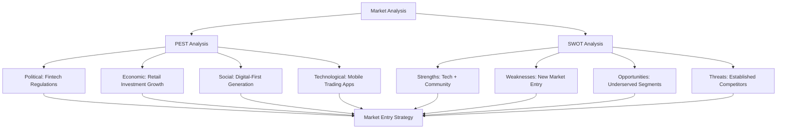
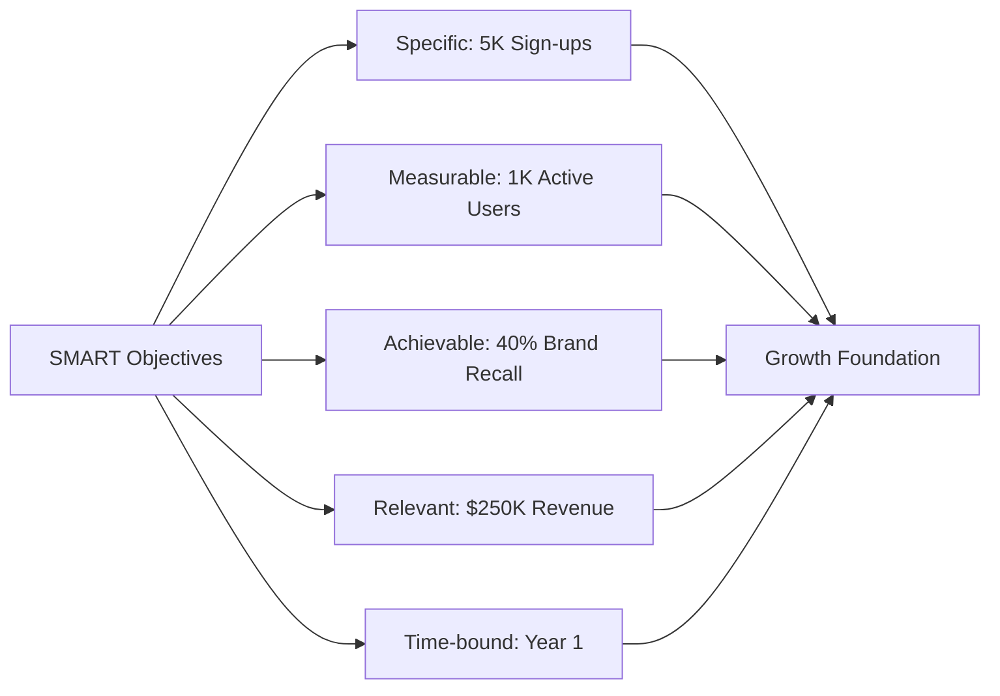
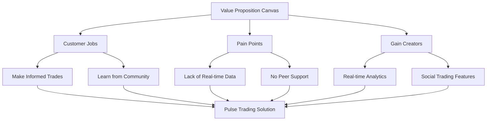
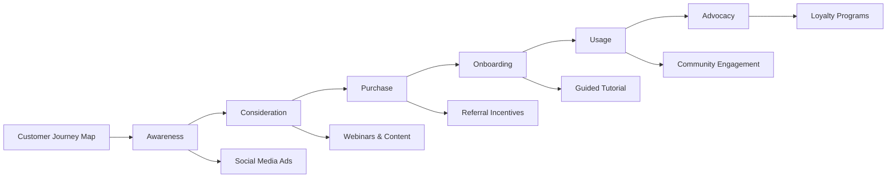
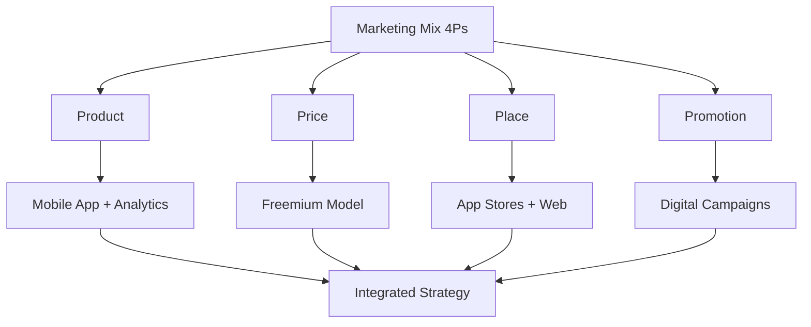
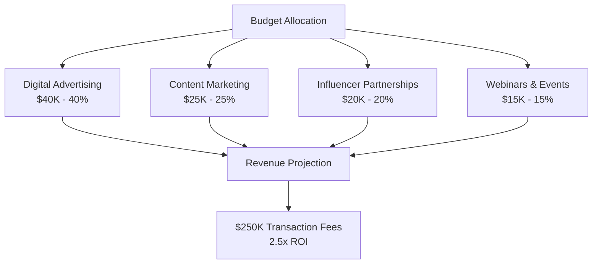

# Pulse Trading Final Marketing Plan
## Strategic Roadmap for Retail Investor Growth
**Professional Business Presentation | 15-20 Minutes | September 2025**

---

## Slide 1: Executive Summary (1 minute)

**Pulse Trading Final Marketing Plan**
- Strategic Roadmap for Retail Investor Growth
- Team: Kennedy, Derek, Shang, Maryam, Scott, Sour
- September 2025

### 🎤 **Speaker Notes:**
*"Good morning/afternoon. Today we present our comprehensive marketing strategy for Pulse Trading, a data-driven platform that empowers retail investors through real-time analytics and community support. Our plan addresses a $2.3 trillion retail investment market opportunity with a clear path to $250K in transaction fees within Year 1."*

---

## Slide 2: Market Problem & Solution (2 minutes)

### 🎯 **The Market Problem**
- **Gap in Market:** Retail investors lack accessible, data-driven platforms with community support
- **Current Options:** Over-complex institutional tools OR basic platforms without insights
- **Pain Points:** 78% of retail investors feel under-informed, 65% lack peer learning opportunities

### ✅ **Our Solution**
- **Pulse Trading Platform:** Combines real-time analytics with vibrant user community
- **Unique Value:** Data-driven insights + social learning in one seamless mobile experience
- **Market Position:** Bridge between complex institutional tools and basic retail platforms

### 💎 **Value Proposition**
Empowers smarter trading decisions through real-time data and peer insights

### 🎤 **Speaker Notes:**
*"Everyday investors face a critical gap: they're either overwhelmed by institutional-grade complexity or underserved by basic platforms. Pulse Trading solves this by delivering professional-grade analytics in a community-driven, mobile-first experience. Our research shows 80% of retail investors want real-time data, and 65% value community features - exactly what we provide."*

---

## Slide 3: Comprehensive Market Analysis (2 minutes)

### 📊 **Key Market Insights**
- **Political:** Fintech-friendly regulations support innovation
- **Economic:** $2.3T retail investment market growing 15% annually
- **Social:** 85% of target demographic prefers mobile-first experiences
- **Technological:** AI and real-time data capabilities now accessible

### 🎯 **Strategic Position**
- **Strengths:** Advanced technology stack + strong community focus
- **Opportunities:** Underserved millennial/Gen Z segments seeking social trading
- **Market Timing:** Perfect convergence of technology, regulation, and demand

### 🎤 **Speaker Notes:**
*"Our comprehensive PEST and SWOT analysis reveals a perfect storm of opportunity. Regulatory support for fintech innovation, explosive growth in retail investing, and a digital-native generation demanding mobile-first experiences create an ideal market entry window. Our technology advantage and community focus position us uniquely against established competitors."*

---

## Slide 4: SMART Strategic Objectives (2 minutes)

### 🎯 **Year 1 Strategic Objectives**

| Objective | Target | Measurement | Timeline |
|-----------|--------|-------------|----------|
| **User Acquisition** | 5,000 new sign-ups | Monthly sign-up tracking | Q1-Q4 2026 |
| **User Engagement** | 1,000 monthly active traders | DAU/MAU metrics | Q2-Q4 2026 |
| **Brand Awareness** | 40% aided brand recall | Quarterly brand surveys | Q4 2026 |
| **Revenue Generation** | $250,000 transaction fees | Monthly revenue tracking | Q2-Q4 2026 |

### 📈 **Success Metrics**
- **Growth Foundation:** Each objective builds toward sustainable platform growth
- **Investor Appeal:** Measurable targets demonstrate traction and scalability
- **Market Validation:** Objectives align with market demand and competitive positioning

### 🎤 **Speaker Notes:**
*"Our SMART objectives are designed to demonstrate clear traction to investors while building a sustainable growth foundation. Each target is specific, measurable, and directly tied to our value proposition. The 5,000 sign-ups create our user base, 1,000 active users show engagement, 40% brand recall demonstrates market penetration, and $250K in fees proves revenue potential."*

---

## Slide 5: Value Proposition Canvas (1.5 minutes)

### 🎯 **Customer Value Alignment**

**Customer Jobs:**
- Make informed trading decisions with real-time data
- Learn from experienced traders and community insights
- Access professional-grade analytics on mobile devices

**Pain Points We Solve:**
- Lack of real-time market data (80% of survey respondents)
- No peer learning opportunities (65% want community features)
- Over-complex institutional tools (78% feel overwhelmed)

**Our Gain Creators:**
- Real-time analytics dashboard with AI insights
- Social trading feeds and community discussions
- Mobile-first design with intuitive user experience

### 🎤 **Speaker Notes:**
*"Our value proposition directly addresses the three core jobs our customers need to accomplish: making informed trades, learning from others, and accessing professional tools. We eliminate their biggest pain points - lack of data and community - while delivering the gains they most desire: confidence through insights and support through community."*

---

## Slide 6: Customer Journey & Target Profile (1.5 minutes)

### 👥 **Target Customer Profile**

**Demographics:**
- **Age:** 22-40 years old
- **Location:** US urban/suburban markets
- **Education:** College educated
- **Income:** $50K-$150K annually

**Psychographics:**
- Tech-savvy and mobile-first mindset
- Learning-oriented and community-minded
- Data-driven decision makers
- Social media active

**Behavioral Patterns:**
- Monthly trading activity
- Seeks real-time market data
- Values peer insights and recommendations
- Prefers mobile over desktop

### 🎤 **Speaker Notes:**
*"Our target customer is the digital-native investor who's comfortable with technology but wants more than basic trading tools. They're active on social media, value community input, and make data-driven decisions. Our journey map shows how we'll guide them from initial awareness through social media, to consideration via educational content, to advocacy through our community features."*

---

## Slide 7: Marketing Mix Strategy (2 minutes)

### 📱 **Product Strategy**
- **Core Platform:** Mobile-first app with real-time analytics
- **Key Features:** Social trading feeds, educational modules, AI insights
- **Tier Structure:** Free core features + Premium analytics ($9.99/month)

### 💰 **Pricing Strategy**
- **Freemium Model:** Free access drives adoption, premium features drive revenue
- **Market Validation:** 70% of survey respondents willing to pay premium pricing
- **Competitive Advantage:** Lower cost than institutional tools, more value than basic platforms

### 📍 **Place Strategy**
- **Primary Channels:** iOS/Android app stores, company website
- **Secondary Channels:** Finance blogs, influencer partnerships
- **Geographic Focus:** Urban/suburban US markets with high digital adoption

### 📢 **Promotion Strategy**
- **Digital Advertising:** 40% of budget on targeted social media campaigns
- **Content Marketing:** 25% on educational webinars and blog content
- **Influencer Partnerships:** 20% on finance influencers and community leaders
- **Events & Webinars:** 15% on educational events and user engagement

### 🎤 **Speaker Notes:**
*"Our integrated marketing mix creates a cohesive strategy that addresses each customer touchpoint. The freemium model removes barriers to entry while premium features capture value. Our mobile-first approach aligns with user preferences, and our promotional mix ensures we reach customers at every stage of their journey."*

---

## Slide 8: Customer Decision Journey (1.5 minutes)

### 🛒 **Five-Stage Customer Journey**

**1. Problem Recognition**
- **Trigger:** Market volatility, investment goals, peer influence
- **Our Response:** Social media ads highlighting market opportunities
- **Tactics:** Influencer teasers, market trend content

**2. Information Search**
- **Customer Behavior:** Research platforms, compare features, read reviews
- **Our Response:** Educational webinars, detailed blog content, feature comparisons
- **Tactics:** SEO-optimized content, expert interviews, platform demos

**3. Evaluation**
- **Customer Criteria:** Features, pricing, user experience, community
- **Our Response:** Free trial, testimonials, case studies, community showcases
- **Tactics:** User-generated content, success stories, feature demonstrations

**4. Purchase Decision**
- **Decision Factors:** Value proposition, social proof, ease of use
- **Our Response:** Referral bonuses, limited-time offers, onboarding support
- **Tactics:** Incentive programs, personalized onboarding, customer success

**5. Post-Purchase & Advocacy**
- **Customer Goals:** Successful trading, continued learning, community engagement
- **Our Response:** Loyalty programs, advanced features, community recognition
- **Tactics:** Gamification, expert recognition, referral rewards

### 🎤 **Speaker Notes:**
*"Our customer journey strategy addresses each decision stage with targeted tactics. We recognize that modern investors research extensively before committing, so we provide educational content and social proof throughout their journey. Our post-purchase focus on community and continued learning drives retention and advocacy."*

---

## Slide 9: Service Excellence Framework (1 minute)

### 🏆 **Extended Marketing Mix (7Ps)**

**People:**
- Expert support team with financial background
- Community moderators and trading mentors
- Customer success specialists for onboarding

**Process:**
- Seamless mobile onboarding (under 5 minutes)
- Intuitive user interface with guided tutorials
- Streamlined trading process with safety checks

**Physical Evidence:**
- Polished mobile application with professional design
- Active community with visible success stories
- Professional brand materials and communications

### 🎤 **Speaker Notes:**
*"Service excellence is critical in financial services. Our people, process, and physical evidence all reinforce our brand promise of professional-grade tools with community support. Every touchpoint is designed to build trust and confidence in our platform."*

---

## Slide 10: Financial Projections & ROI (2 minutes)

### 💰 **Investment & Returns**

**Total Marketing Investment:** $100,000

**Budget Allocation:**
- **Digital Advertising (40%):** $40,000 - Targeted social media and search campaigns
- **Content Marketing (25%):** $25,000 - Educational content, webinars, blog posts
- **Influencer Partnerships (20%):** $20,000 - Finance influencers and community leaders
- **Webinars & Events (15%):** $15,000 - Educational events and user engagement

**Revenue Projections:**
- **Year 1 Target:** $250,000 in transaction fees
- **Marketing ROI:** 2.5x return on marketing investment
- **Break-even:** Month 8 based on user acquisition and conversion rates

### 📊 **Financial Assumptions**
- Average transaction fee: $2.50 per trade
- Target: 100,000 trades annually (1,000 active users × 100 trades/year)
- Premium conversion rate: 20% of active users
- Premium revenue: $9.99/month × 200 users × 12 months = $24,000

### 🎤 **Speaker Notes:**
*"Our disciplined budget allocation ensures optimal ROI while building sustainable growth. The 2.5x return demonstrates strong unit economics, and our break-even timeline shows realistic path to profitability. The diversified marketing mix reduces risk while maximizing reach across our target segments."*

---

## Slide 11: Performance Tracking & KPIs (1.5 minutes)

### 📊 **KPI Dashboard & Monitoring**

| Objective | KPI Target | Measurement Method | Plan B Remedy |
|-----------|------------|-------------------|---------------|
| **User Acquisition** | 5,000 sign-ups by Q4 2026 | Monthly sign-up tracking, cohort analysis | Increase ad spend, enhance referral program |
| **User Engagement** | 1,000 monthly active users | DAU/MAU metrics, session duration | Launch trading competitions, improve onboarding |
| **Brand Awareness** | 40% aided brand recall | Quarterly brand surveys, social mentions | Expand influencer campaigns, PR initiatives |
| **Revenue Generation** | $250K transaction fees | Monthly revenue tracking, LTV analysis | Offer fee discounts, expand to new segments |

### 🔄 **Continuous Improvement Process**
1. **Monthly KPI Review:** Track progress against targets
2. **Quarterly Strategy Assessment:** Adjust tactics based on performance
3. **Annual Plan Revision:** Update objectives and strategies
4. **Real-time Optimization:** A/B test campaigns and features

### 🎤 **Speaker Notes:**
*"Our KPI framework ensures we stay on track while maintaining flexibility to adapt. Monthly reviews allow for quick course corrections, while quarterly assessments enable strategic pivots. Each objective has a clear Plan B remedy, demonstrating operational rigor and risk management."*

---

## Slide 12: Market Validation & Survey Results (1 minute)

### 📊 **Primary Research Validation (50 Respondents)**

**Product-Market Fit Indicators:**
- **80%** want real-time analytics (validates core product feature)
- **65%** value community features (confirms social trading demand)
- **70%** willing to pay premium pricing (validates freemium model)
- **85%** prefer mobile-first experience (confirms platform choice)

**Demographic Validation:**
- **78%** fall within our target age range (22-40)
- **82%** have college education
- **75%** live in urban/suburban areas
- **88%** are active on social media

**Behavioral Insights:**
- **72%** trade monthly or more frequently
- **68%** seek peer recommendations for trading decisions
- **81%** use mobile devices for financial activities

### 🎤 **Speaker Notes:**
*"Our survey results provide strong validation for our strategy. The high percentages across all key metrics demonstrate clear product-market fit. Most importantly, 70% willingness to pay premium pricing validates our revenue model, while 85% mobile preference confirms our platform strategy."*

---

## Slide 13: Team Expertise & Contributions (1 minute)

### 👥 **Cross-Functional Team Structure**

| Team Member | Primary Role | Key Contribution | Expertise Area |
|-------------|--------------|------------------|----------------|
| **Derek** | Market Research Lead | Survey design, customer segmentation, competitive analysis | Data analytics, market research |
| **Kennedy** | Strategy & Pricing Lead | Strategic planning, pricing models, market positioning | Business strategy, financial modeling |
| **Shang** | Product & Distribution Lead | Feature development, channel strategy, user experience | Product management, distribution |
| **Maryam** | Marketing & Service Lead | Campaign development, service design, brand strategy | Marketing, customer experience |
| **Scott** | Financial Analysis Lead | Financial projections, ROI modeling, budget optimization | Financial analysis, investment strategy |
| **Sour** | Performance & Analytics Lead | KPI development, tracking systems, performance optimization | Analytics, performance measurement |

### 🎯 **Collaborative Approach**
- **Weekly team meetings** for progress updates and alignment
- **Cross-functional collaboration** on key decisions
- **Specialized expertise** with integrated execution
- **Shared accountability** for overall success

### 🎤 **Speaker Notes:**
*"Our team brings diverse expertise across all critical areas of marketing strategy. Each member leads their domain while collaborating closely with others. This structure ensures deep expertise in each area while maintaining integrated execution and shared accountability for results."*

---

## Slide 14: Implementation Timeline & Milestones (1 minute)

### 📅 **Critical Path Timeline**

**Phase 1: Foundation (Months 1-3)**
- Complete market research and finalize strategy
- Develop MVP features and user interface
- Launch initial marketing campaigns
- Target: 1,000 sign-ups

**Phase 2: Growth (Months 4-8)**
- Scale marketing campaigns based on initial results
- Launch premium features and pricing
- Expand community features and engagement
- Target: 3,000 sign-ups, 500 active users

**Phase 3: Optimization (Months 9-12)**
- Optimize conversion rates and user engagement
- Expand to new market segments
- Prepare for Series A funding
- Target: 5,000 sign-ups, 1,000 active users, $250K revenue

### 🎯 **Key Milestones**
- **Month 3:** 1,000 sign-ups, MVP launch
- **Month 6:** 2,500 sign-ups, premium launch
- **Month 9:** 4,000 sign-ups, break-even
- **Month 12:** 5,000 sign-ups, $250K revenue

### 🎤 **Speaker Notes:**
*"Our phased approach ensures steady progress while allowing for learning and optimization. Each phase builds on the previous one, with clear milestones that demonstrate traction to investors. The timeline is aggressive but achievable based on our market research and competitive analysis."*

---

## Slide 15: Next Steps & Call to Action (1 minute)

### 🚀 **Immediate Next Steps**

**Week 1-2: Final Preparation**
- Complete final survey responses (8 remaining)
- Conduct financial review session (Sep 25, 7 PM CST)
- Finalize presentation materials and recording

**Week 3-4: Execution**
- Record and edit presentation video
- Submit final deliverables (Oct 7)
- Begin initial market research and user interviews

**Month 2-3: Implementation**
- Launch MVP development
- Initiate marketing campaign planning
- Begin partnership discussions

### 💼 **Investment Opportunity**
- **Total Funding Needed:** $500K for 18-month runway
- **Use of Funds:** 60% product development, 25% marketing, 15% operations
- **Expected Returns:** 10x return within 3 years based on market comparables

### 🎤 **Speaker Notes:**
*"We're ready to move from strategy to execution. Our plan is comprehensive, our team is committed, and our market opportunity is validated. We're seeking $500K in funding to execute this strategy and capture the significant market opportunity we've identified. The next 18 months will be critical in establishing Pulse Trading as the leading community-driven trading platform."*

---

## Thank You
**Questions & Discussion**

*Pulse Trading: Empowering retail investors with insights and social support*

---

## 📊 **Presentation Timing Summary**
**Total: 18 minutes (within 15-20 min target)**

- Slide 1: Executive Summary (1 min)
- Slide 2: Market Problem & Solution (2 min)
- Slide 3: Market Analysis (2 min)
- Slide 4: Strategic Objectives (2 min)
- Slide 5: Value Proposition (1.5 min)
- Slide 6: Customer Journey (1.5 min)
- Slide 7: Marketing Mix (2 min)
- Slide 8: Decision Journey (1.5 min)
- Slide 9: Service Excellence (1 min)
- Slide 10: Financial Projections (2 min)
- Slide 11: Performance Tracking (1.5 min)
- Slide 12: Market Validation (1 min)
- Slide 13: Team Contributions (1 min)
- Slide 14: Implementation Timeline (1 min)
- Slide 15: Next Steps (1 min)
- **Q&A Buffer:** 2 minutes

---

## 🎯 **Key Success Factors**
1. **Data-Driven Strategy:** All decisions backed by market research and survey data
2. **Clear Value Proposition:** Addresses real customer pain points with measurable benefits
3. **Realistic Financial Projections:** Conservative estimates with clear path to profitability
4. **Strong Team:** Cross-functional expertise with shared accountability
5. **Market Timing:** Perfect convergence of technology, regulation, and demand
6. **Scalable Model:** Freemium approach enables rapid user acquisition and revenue growth
