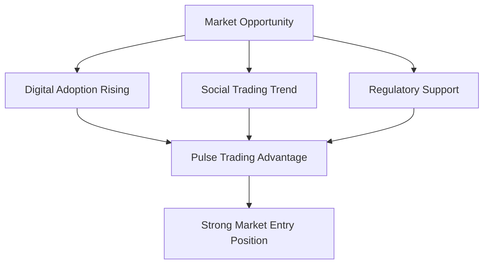
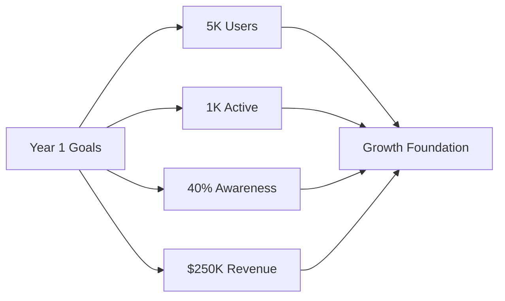
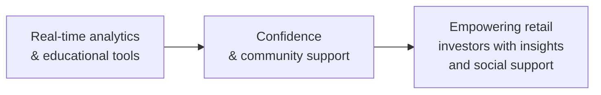
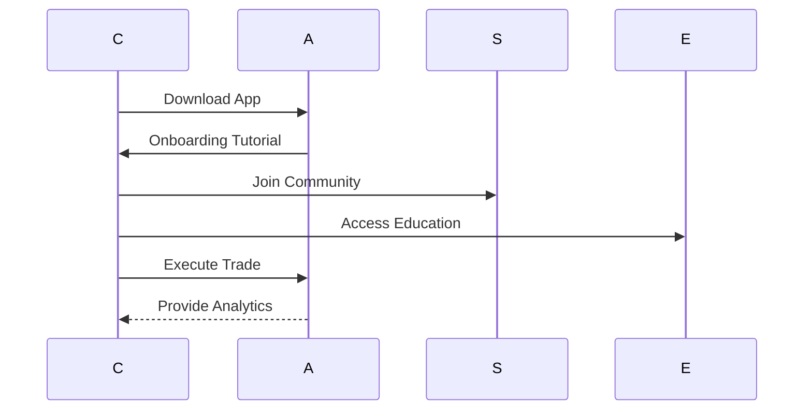
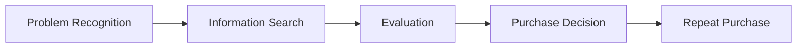
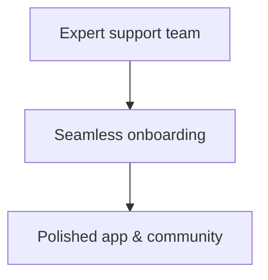
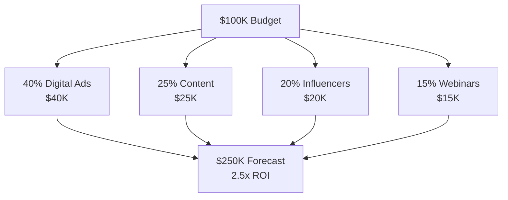
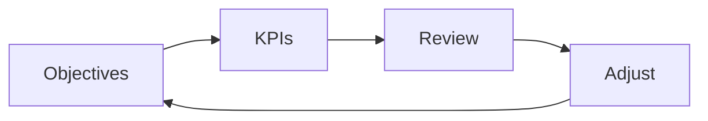

# Pulse Trading Final Marketing Plan
## Strategic Roadmap for Retail Investor Growth
**15-20 Minute Presentation | September 2025**

---

## Slide 1: Title (1 min)
**Pulse Trading Final Marketing Plan**
- Strategic Roadmap for Retail Investor Growth
- Team: Kennedy, Derek, Shang, Maryam, Scott, Sour
- September 2025

---

## Slide 2: The Challenge & Solution (2 min)

### 🎯 **The Problem**
Retail investors lack accessible, data-driven platforms with community support

### ✅ **Our Solution**
Pulse Trading combines real-time analytics with vibrant user community

### 💎 **Value**
Empowers smarter trading through data and peer insights

---

## Slide 3: Market Opportunity (2 min)

**Market Drivers:**
- **Digital Adoption:** 85% prefer mobile-first trading
- **Social Trading:** 65% value community features
- **Regulatory Support:** Fintech-friendly policies
- **Result:** Perfect timing for Pulse Trading entry

---

## Slide 4: Strategic Objectives (2 min)

**Measurable Targets:**
1. **5,000** new sign-ups (user acquisition)
2. **1,000** monthly active traders (engagement)
3. **40%** aided brand recall (awareness)
4. **$250,000** transaction fees (revenue)

---

## Slide 5: Value Proposition (1.5 min)

**Positioning:** "Empowering retail investors with insights and social support"

---

## Slide 6: Target Customer Journey (1.5 min)

**Target Profile:**
- **Demographics:** Age 22-40, US urban/suburban, college educated
- **Behavior:** Monthly trading, seeks real-time data, values peer insights

---

## Slide 7: Marketing Mix - Product & Price (2 min)

### 📱 **Product**
- Mobile-first app with real-time analytics
- Social feeds & educational modules
- **Free core tier** + **Premium analytics ($9.99/mo)**

### 💰 **Pricing Strategy**
- Freemium model validated by survey data
- 70% willing to pay premium pricing

---

## Slide 8: Customer Decision Journey

**Campaign Strategy:**
- **PR:** Social ads, influencer teasers
- **IS:** Webinars, blog posts
- **EV:** Testimonials, case studies
- **PD:** Referral bonuses
- **RP:** Loyalty programs

---

## Slide 9: Service Excellence

**3Ps Implementation:**
- **People:** Expert support team
- **Process:** Seamless onboarding
- **Evidence:** Polished app & community

---

## Slide 10: Financial Projections (2 min)

**Budget Allocation:**
- **Total:** $100,000
- **Forecast:** $250,000 transaction fees
- **ROI:** 2.5× MROI

---

## Slide 11: Performance Tracking (1.5 min)

| Objective | Target | Plan B Remedy |
|-----------|--------|---------------|
| **Sign-ups** | 5,000 by Q4 2026 | Increase ad spend & referrals |
| **Active Users** | 1,000 monthly | Trading competitions |
| **Brand Awareness** | 40% aided recall | Influencer campaigns |
| **Transaction Volume** | $250K in fees | Fee discounts & expansion |

---

## Slide 12: Survey Validation (1 min)

### 📊 **Key Findings (50 Respondents)**
- **80%** want real-time analytics
- **65%** value community features  
- **70%** willing to pay premium
- **85%** prefer mobile-first

**Impact:** Validates product design, pricing, and promotional priorities

---

## Slide 13: Team Contributions (1 min)

| Member | Role | Key Contribution |
|--------|------|------------------|
| **Derek** | Target Analysis | Survey design & segmentation |
| **Kennedy** | Strategy & Pricing | Requirements & pricing modeling |
| **Shang** | Product & Distribution | Features & channel strategy |
| **Maryam** | Promotion & Service | Campaigns & service blueprint |
| **Scott** | Financial Projections | Models & ROI analysis |
| **Sour** | KPI Development | Metrics & tracking framework |

---

## Slide 14: Implementation Timeline (1 min)

### 📅 **Key Milestones**
- **Sep 26:** Complete survey (8 responses)
- **Sep 25:** Financial review @ 7 PM CST
- **Oct 3:** Deck finalization
- **Oct 4:** Feedback revisions
- **Oct 5:** First recording
- **Oct 6:** Final video
- **Oct 7:** Submission

**Ready for VC investment and rapid scale**

---

## Slide 15: Next Steps (1 min)

### 🚀 **Immediate Actions**
1. Complete final survey responses
2. Conduct financial review session
3. Finalize presentation materials
4. Execute recording and production

### 📈 **Success Metrics**
- Timely delivery of all milestones
- Quality assurance at each stage
- Continuous improvement based on feedback

---

## Thank You
**Questions & Discussion**

*Pulse Trading: Empowering retail investors with insights and social support*

---

## 📊 **Presentation Timing Summary**
**Total: 18 minutes (within 15-20 min target)**

- Slide 1: Title (1 min)
- Slide 2: Challenge & Solution (2 min)
- Slide 3: Market Opportunity (2 min)
- Slide 4: Strategic Objectives (2 min)
- Slide 5: Value Proposition (1.5 min)
- Slide 6: Customer Journey (1.5 min)
- Slide 7: Product & Price (2 min)
- Slide 8: Customer Decision Journey (1.5 min)
- Slide 9: Service Excellence (1 min)
- Slide 10: Financial Projections (2 min)
- Slide 11: Performance Tracking (1.5 min)
- Slide 12: Survey Validation (1 min)
- Slide 13: Team Contributions (1 min)
- Slide 14: Implementation Timeline (1 min)
- Slide 15: Next Steps (1 min)
- **Q&A Buffer:** 2 minutes
